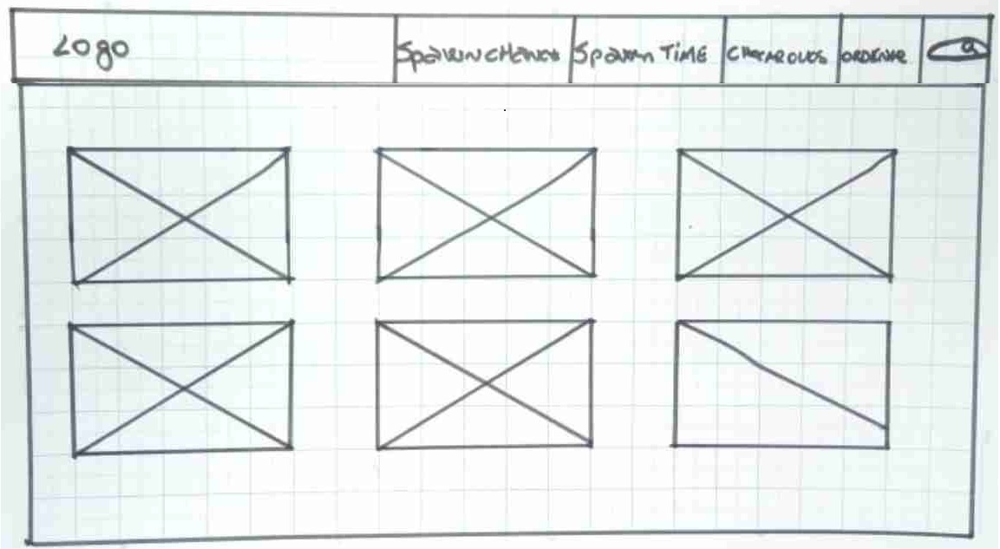
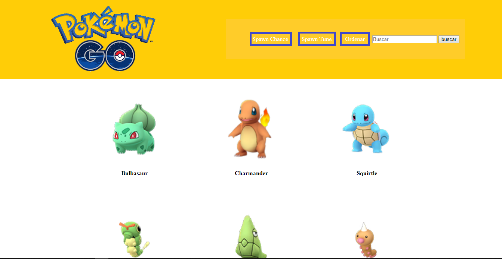
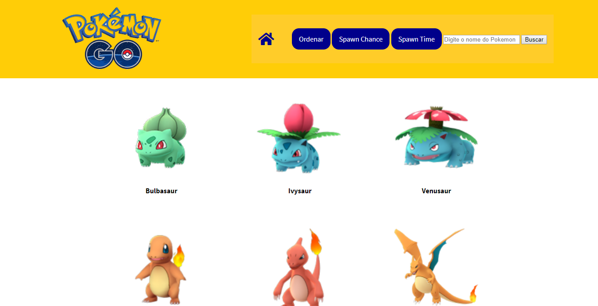

# Data Lovers

## Índice

* [Preâmbulo](#preâmbulo)
* [Definição do produto](#definição_do_produto)
* [Público alvo](#público_alvo)
* [Testes de Usabilidade](#testes_de_usabilidade)
* [Protótipos](#protótipos)

## Preâmbulo

O jogo Pokémon GO é um jogo de realidade aumentada voltado para smartphones, lançado em 2016 e que virou febre mundial. Com o uso do GPS e a câmera do celular, o jogo permite aos jogadores capturar, batalhar e treinar criaturas chamadas Pokémon, famosas mundialmente desde os anos 90 pelo anime de mesmo nome.
Para os jogadores de Pokemon GO uma das metas principais é ter o máximo de tipos diferentes de pokémon em sua coleção e com o passar do tempo, informações para ajudar o jogador neste objetivo foram calculadas e alimentadas na internet. Em que horário devo sair na rua para encontrar o pokémon que me falta? Qual pokémon é mais raro de se encontrar? Esta e outras questões fazem a diferença na vida do jogador de Pokémon GO.

## Definição_do_produto

Nosso site reune informações importantes para o usuário do jogo Pokémon GO dentro das primeiras 151 criaturas, consideradas as clássicas.
Focando nos dados de spawn chance e spawn time, o nosso usuário pode visualizar todas as 151 criaturas, filtrá-las de acordo com grupos específicos, buscar por nome ou ordena-las, bem como visualizar a média de chance de encontrar todo um grupo específico de pokémons.
Nosso processo de desenvolvimento levou em consideração os dados que nos foram disponibilizados e através de experiência pessoal com o jogo, observamos quais daqueles dados seriam de maior relevância para um jogador e como seria a melhor e mais prática visualização deles na tela.
Este site ajuda a resolver um grande problema do colecionador pokémon, que é facilitar a busca às criaturas que ele ainda não possui. Ele poderá em nosso site visualizar todas as 151 clássicas e checar quais ainda não possui. De acordo com as que ele não possui, pode então ver em que horário é mais fácil encontra-las pela rua, bem como o grau de raridade para encontra-la. Seria o caso de azar não te-la encontrado até agora? Ou talvez é o jogador quem não está jogando naquele horário em que é mais fácil de encontra-la? E esse pokémon que já busco a tanto tempo, ele está mesmo entre os mais raros de se encontrar? Essas questões são resolvidas com o nosso site.

## Público_alvo
Quem são os principais usuários de seu produto?
	Jogadores ativos de Pokemon Go.
Quais são os objetivos de seu usuário com relação ao seu produto?
	Saber o quão raro ou o quão fácil é de encontrar um pokemon do seu interesse pela rua enquanto joga, bem como o horário mais fácil de encontrar e capturar determinado pokémon.
Quais os dados mais importantes que eles querem ver em sua interface?
	Nome, Spawn chance e Spawn time.
Quando utilizam ou utilizariam seu produto?
	Em 2 ocasioes - Para ver a chance de encontrar um pokemon específico ao jogarem o Pokémon GO ou para saber o horário mais fácil de encontrar um pokémon que eles ainda não tenham pela rua.

Personas

	Carateristicas
		Daniel
		29 anos, Solteiro, Sem filhos
		Mora sozinho no RJ
		Joga Pokemon Go no minimo 4 vezes por semana no caminho entre faculdade e trabalho
		Trabalha e faz faculdade de administração
	Necessidades
		Tem pouco tempo livre.
		Busca novas tecnologias e informações constantemente.
		Gosta de praticidade no seu dia a dia.
    	Seus hobbies são sua válvula de escape no seu stress diário e não abre mão do tempo que dedica a eles.		

	Caracteristicas
		Vitória
		15 anos
		Mora com a mãe
		Joga Pokemons Go com diversos colegas de classe
		Faz ensino médio e curso de inglês 2 vezes na semana
	Necessidades
		Não tem um celular top de linha, sente falta de memória para instalar novos aplicativos.
		Quer evoluir rápido em seus hobbies, não tem muita paciência.
		Quer entrar para o ranking de mestres pokemons da escola.
    	Não gosta de sites pesados com muitas informações, é atraída por sites com fontes de fácil acesso.		

## Testes_de_usabilidade

Entrevistas com os usuários utilizando o Protótipo Inicial Digital

* Aline - "Não encontrei nenhum problema, o site está fácil de encontrar as informações e simples de visualizar".
* Alice - "Curti seu site, para um próximo seria legal incluir todos os pokemons existentes no jogo atualmente".
* William - "Fácil e simples de visualizar, mas senti falta de um link para voltar a ver os 150 depois de ter filtrado".
* Erthelles - "Legal e bem visual, mas seria bom colocar algo para facilitar voltar para o topo. Muitos sites já usam e a lista de vocês é bem comprida com tanto pokémon".
* Elisama - "Bonitinho, gostei das cores, mas está difícil visualizar os links com branco dentro do amarelo".

* Problemas detectados nos testes->

-Não havia um botão para voltar aos 151 pokémons após ter utilizado qualquer filtro, adicionamos o botão de home.

-Não havia nenhum botão para facilitar a navegação quando o usuário estivesse vendo os 151 pokémons, adicionamos um link de "volte ao topo" no fim da página.

-Mudamos o esquema de cores para facilitar visualização.

## Protótipos

*Protótipo Inicial em Papel

*Protótipo Inicial Digital

*Protótipo Final Digital

*Protótipo Final Marvel
[Link](https://marvelapp.com/b3ehh34)
